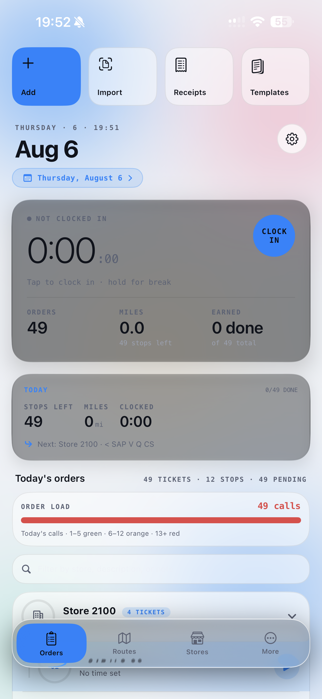
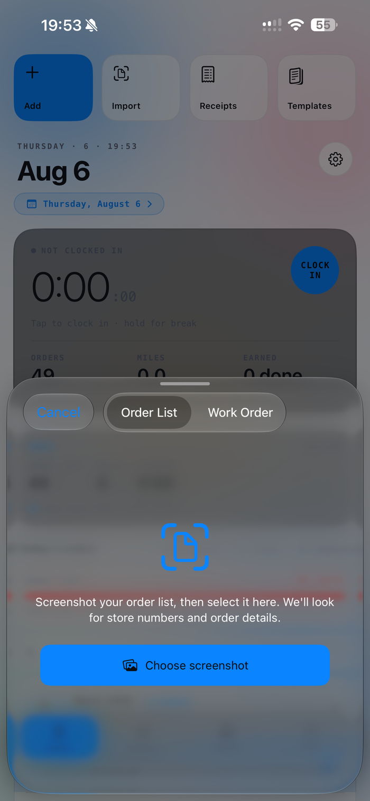
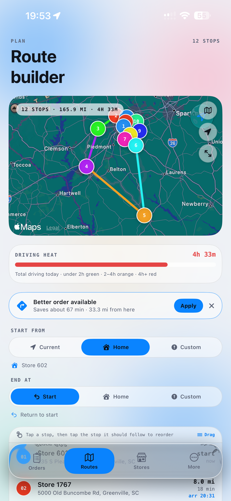
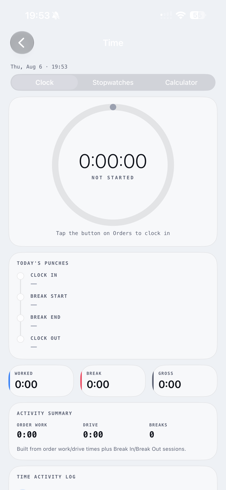

[README.md](https://github.com/user-attachments/files/30806502/README.md)
# WorkTimeTracker

**One app for the whole field day.** Native iOS app for field service technicians — clock in, run the route, scan the receipts, count the miles. Built with an assist from Claude Code and Gemini.

`SwiftUI` · `iOS 17+` · `Zero dependencies` · `On-device OCR` · `15 themes`

> **[View the full showcase →](https://CHAMOUSS.github.io/WorkTimeTracker/)** *(GitHub Pages: `img/index.html`)*

---

## Why it exists

I like to make things I need.

A field tech's day is 12+ store visits, a shift clock nobody keeps for you, gas receipts in the door pocket, and a route that's yours to figure out. Off-the-shelf time trackers do timers; they don't know what a stop is. WorkTimeTracker treats **route + stores + time + proof** as one problem — the day gets planned, driven, logged, and reimbursed from a single screen. It started as a tool for my own shifts and grew into a full product.

---

## Features

### 01 · Order tracker + shift clock

Home is a live hero card: elapsed shift time, orders done, miles driven, earnings so far. Tap to clock in, hold for a break — punches, breaks, and per-order work/drive time land in the day's log automatically.

- Order load meter warns when the call count runs hot
- Smart break detection fills in the punches you forgot
- Full punch timeline: clock in, breaks, clock out

 

### 02 · Receipt scanner
On-device Vision OCR reads the date, the total, and — for gas receipts — the vehicle and odometer fields. No cloud, no subscription, no typing $13.27 into a spreadsheet at 9pm.

- Handles messy formats: `13.27`, `13,27`, even 1-digit cents
- Photos stored privately in app storage, exportable to PDF
- Every scan feeds the expense + mileage reports

### 03 · Schedule + route importer

The day's orders arrive as an SAP work-order screen. Instead of retyping 49 tickets, screenshot it — the importer reads store numbers, descriptions, and dates straight off the image and builds the day.

- Two modes: order lists and full work orders
- Imported days land on the calendar, weeks ahead
- Duplicate-day and copy-yesterday for recurring routes

 

### 04 · Route optimizer

A genetic-algorithm optimizer runs over the day's stops and quietly offers a better order — 67 minutes saved on a 12-stop, 165-mile day. One tap to apply.

- Smart Loop, Fastest, and Shortest strategies
- Start/end anywhere: current spot, home store, custom
- Driving-heat meter keeps total windshield time honest

 

### 05 · Stores map
The full store roster on a clustered map — filter to your team, district, or whatever's nearby. Tap a pin for distance, last visit, and on-time record. Travel-time aware: distance is drive time, not geometry.

### 06 · Widgets + Live Activities
The running shift lives in the Dynamic Island and as a Live Activity — clock, next stop, ETA — so the phone never needs unlocking mid-route.

- Live Activity with pause/stop actions from the lock screen
- Widgets refresh adaptively to spare the battery
- Siri + Shortcuts: "clock me in" from CarPlay

### 07 · Earnings + mileage

Hours, drive time, and auto-logged mileage roll up into weekly earnings — with the IRS-rate deduction already computed. Payroll CSV and PDF mileage reports export in a tap.

- Automatic mileage logging between stops
- Earnings forecast from the pace of the current day
- Payroll CSV + PDF report exporters built in

 

---

## Fifteen themes, one app

Not color swaps — complete visual systems. Each theme owns its palette, type pairing, shape language, and map style, switchable live from Settings:

**Liquid Glass** (tintable accent) · Aurora · Paperline · Console · Cyber · Patriot · Astra · Onyx · Solstice · Nocturne · Blueprint · Riso · Venom · Graphite · Voltage

---

## Built with care

- **Pure Apple SDK, zero dependencies** — SwiftUI throughout, Vision for OCR, MapKit for routing and clustering, ActivityKit for Live Activities
- **Private by default** — all OCR runs on-device; receipts live in app storage; iCloud sync; biometric lock
- **Tested where it hurts** — unit suites cover the receipt parser, route optimizer, earnings math, and data integrity

---

*Designed and built end-to-end by one person — product, design, and Swift.*
